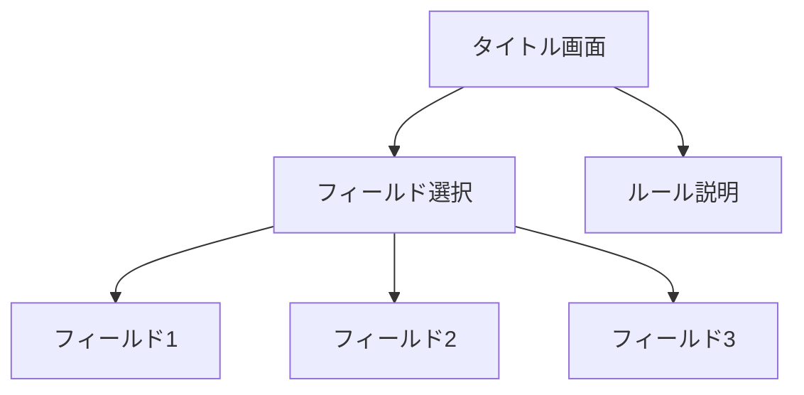

# 迷宮鬼ごっこ(BallingMaze)

プレイヤーは球体を操作して迷宮の中を移動し、鬼から逃げるゲームです。
鬼はただ真っ直ぐにプレイヤーを追いかけてくるだけの単純なCOMです。

## ルール
プレイヤーはフィールドの内にあるキーを3つ入手して最後の扉を開けるとクリアです。
ただし、鍵を一つ入手するごとに鬼が現れ、捕まるとゲームオーバーです。
初めは鬼はいませんが、最後には3体の鬼がプレイヤーを追いかけてきます。

## 操作方法
右クリック+ドラッグで視点操作  
WASDで移動  
Qで視点切り替え(一人称視点と三人称視点)  
Escでポーズ

## 画面遷移

## 工夫点
### 1. 一人称視点と三人称視点でマウス操作の挙動を調整
どちらもパン操作になるようにしているが、実装するには外から内を見る三人称視点と、内から外を見る一人称視点では左右操作が逆になってしまう。
そのため視点切り替えの際に視点変数を変えることにして、視点変数に応じて逆にすることでどちらもパン操作を実現している。

### 2. 難易度調整
始めは鬼がいないので、プレイヤーは迷宮を探索することに集中できる。
鍵を一つ入手するごとに鬼が現れ、プレイヤーを追いかけてくる。
終盤になると鬼に挟み撃ちされることが多くなるとゲームとして破綻してしまうので、鬼の挙動はただプレイヤーをめがけて進むのみとし、
壁に沿うとき速度が3倍になるようにすることでバランスをとった。
また、1人称視点のときはプレイヤーの視界が狭くなるので、その分少し早く移動できるように設定した。

### 3. txtファイルを読み込んで迷宮を生成する
プログラム内に迷宮のデータを持たせると迷宮の種類を増やすのが大変になるので、txtファイルを読み込んで迷宮を生成するようにした。
これによって迷宮の設定を変更しやすくなり、難易度調整がしやすかった。

### 4. BGMとSEの実装
使用している音声は以下の通りです。

- タイトルBGM: `maou_bgm_cyber42.mp3`
- 通常BGM（鬼出現前）: `maou_bgm_cyber41.mp3`
- 追跡BGM（鬼出現後）: `maou_bgm_cyber44.mp3`
- ゲームオーバーBGM: `maou_se_magical31.mp3`
- キー取得SE: `maou_se_battle05.mp3`
- ゲームクリアSE: `maou_se_inst_piano1_g_chord.mp3`

引用元：
https://maou.audio/

## 配布手順（他環境向け）

1. 実行ファイルをビルドします（推奨: Release x64）。
2. ルートで次を実行して配布フォルダを生成します。
   - `powershell -ExecutionPolicy Bypass -File .\tools\prepare_distribution.ps1 -Configuration Release -Platform x64`
3. `dist\BallingMaze\` に以下が揃っていることを確認します。
   - `BallingMaze.exe`
   - `maze_set*.txt`
   - `maou_*.mp3`
   - `freeglut.dll`（または環境に応じたGLUT DLL）
4. Inno Setupで `installer\BallingMaze.iss` を開き、Compileしてインストーラーを作成します。

生成されるインストーラー設定:
- アプリ名: `BallingMaze`
- バージョン: `1.0.0`
- インストール先: 現在ユーザー（管理者権限不要）
- ショートカットアイコン: exe内アイコンを利用
